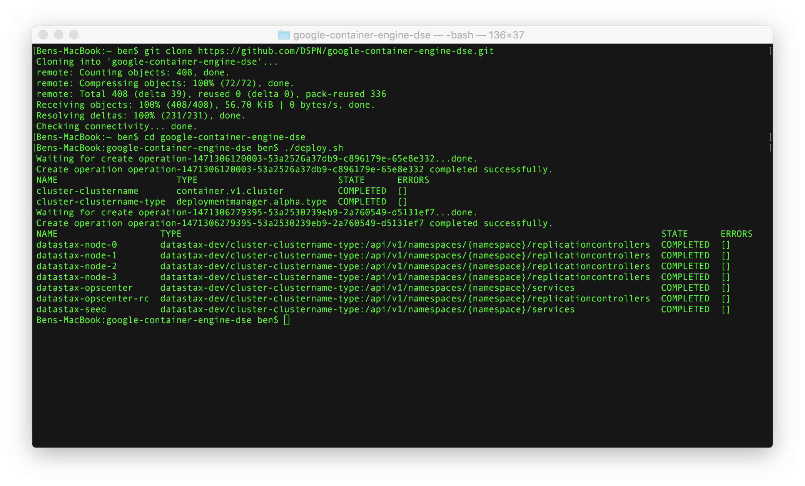
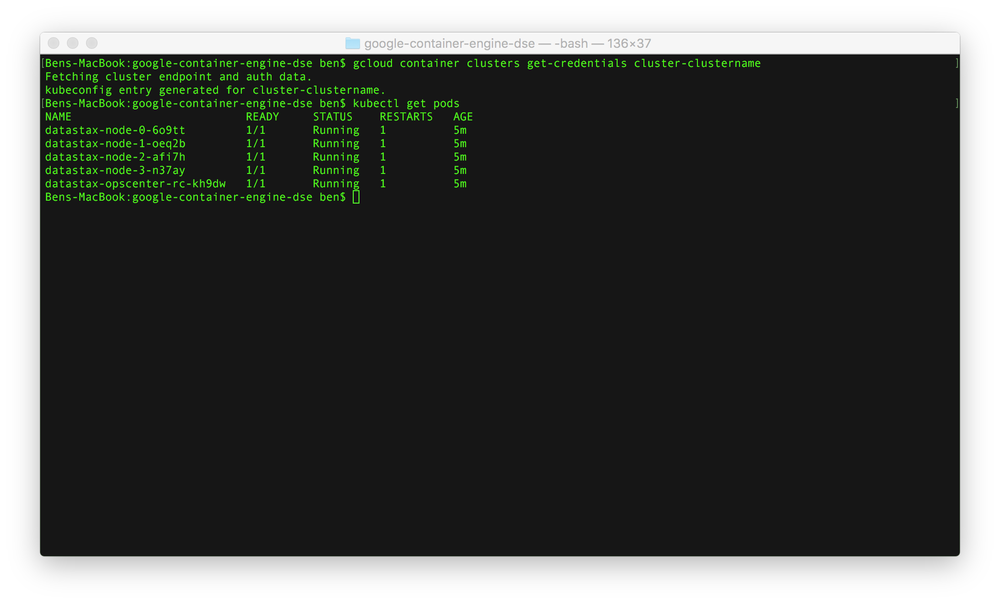
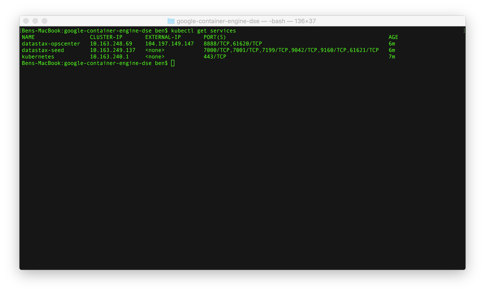

# google-container-engine-dse
Google Deployment Manager scripts for deploying DataStax Enterprise (DSE) on Google Container Engine (GKE)

## Creating a Cluster

The [deploy.sh](deploy.sh) script wraps both the deploy cluster and deploy DataStax commands.  You will need gcloud installed and configured.  By default this will deploy a four node cluster.  To create a cluster simply clone this repo and run the deploy command:

	git clone https://github.com/DSPN/google-container-engine-dse.git
	cd google-container-engine-dse
	./deploy.sh

A successful deploy should look like this:

## Working with a Cluster

With the current configs, our cluster is always called cluster-clustername, so we can get credentials by running:

    gcloud container clusters get-credentials cluster-clustername

Now kubectl will be able to connect to the cluster.  We can get the names of the nodes with the command:

    kubectl get pods

Once you get a pod's name, you can run the following.  Previous is especially useful in debugging as it shows the logs from the last container that attempted to run.

    kubectl logs datastax-opscenter-rc-5qjv6
    kubectl logs --previous datastax-opscenter-rc-5qjv6

To get the external IP of the OpsCenter machine (running on port 8888) use the following command.  You can then open a web browser to that ip and port to view OpsCenter.

    kubectl get services

To check your cluster is running from the command line you can run:

    kubectl exec datastax-node-0-n1yqu nodetool status

To get an interactive session to a node you can run:

    kubectl exec -it datastax-node-0-8yk87 /bin/bash

## Deleting a Cluster

The [https://cloud.google.com/](https://cloud.google.com/) interface currently has an issue deleting a cluster.  A workaround is provided in the [delete.sh](delete.sh) script.  To delete the cluster simply run:

    ./delete.sh
