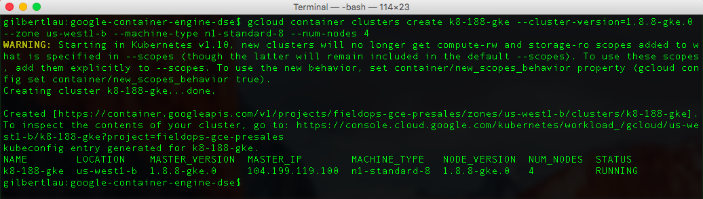
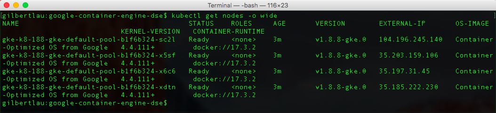
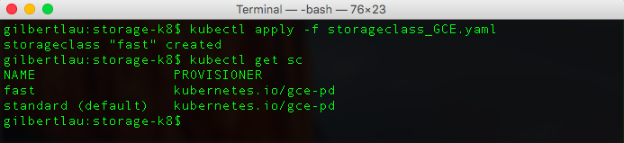
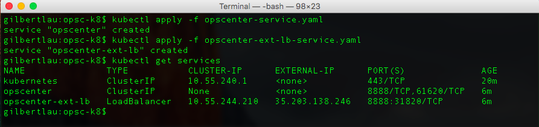
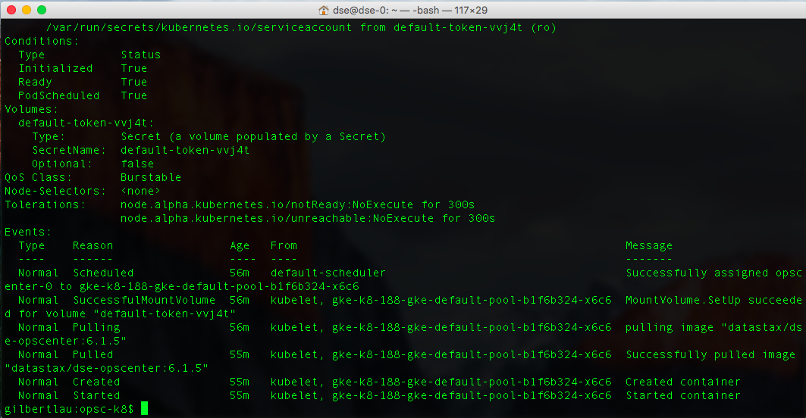
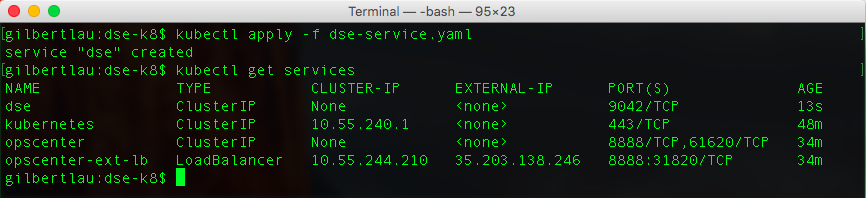
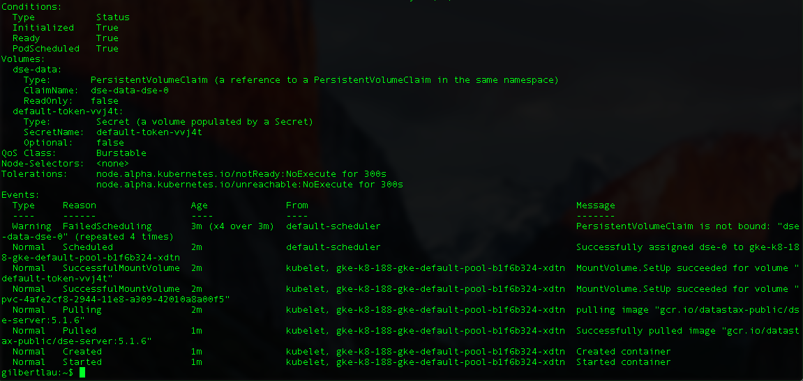
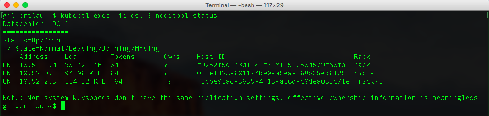
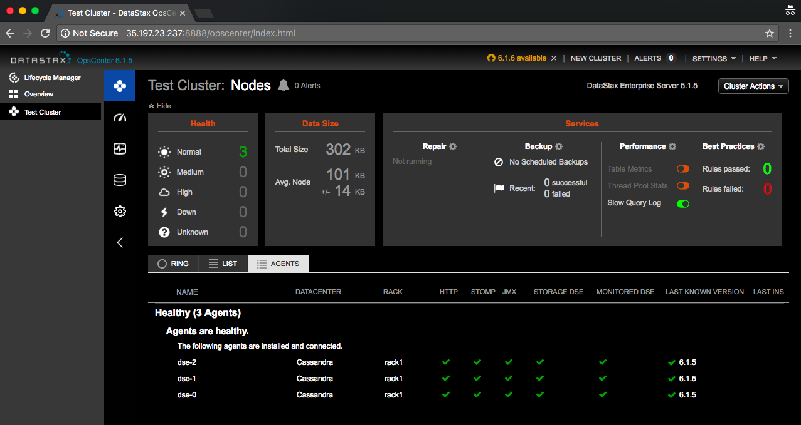

# google-container-engine-dse
Scripts for deploying DataStax Enterprise (DSE) on Google Container Engine (GKE)

## Disclaimer
The use of this repo is intended for development purpose only.  Usage of this repo is solely at user’s own risks.  There is no SLAs around any issues posted on this repo.  Internal prioritization of repo issues will be processed by the owners of this repo periodically.  There is no association with any technical support subscription from DataStax.

The use of DataStax software is free in development. Deploying and running DataStax software on a cloud provider will incur costs associated with the underlying cloud provider’s resources such as compute, network and storage, etc.  Please refer to your cloud provider for effective cloud resources pricing.

## Licensing Terms
Deploying DataStax Enterprise on Google Container Engine (GKE) includes a limited no-fee license from DataStax. As described in section 1.4 of [DataStax Enterprise Terms](https://www.datastax.com/enterprise-terms), the limited license is for development or non-production use.

#### Prerequisites:
* Check [here](https://cloud.google.com/sdk/gcloud/) to find out how to install **gcloud** as part of the Google Cloud SDK.
* Check [here](https://kubernetes.io/docs/tasks/tools/install-kubectl/) to find out how to install **kubectl**, the Kubernetes command-line tool.

##### Step 1. Create a Google Container Engine (GKE) cluster
You are required to create a GKE cluster using vm type, **n1-standard-8** in order to have ample CPU and memory to deploy a DSE cluster.  In addition, the artifacts in this repo have been tested in a GKE cluster version **v1.8.8-gke.0**.  The command to create such cluster with 4 worker nodes in **us-west1-b** availability zone is shown below. 
```
$ gcloud container clusters create k8-188-gke --cluster-version=1.8.8-gke.0 --zone us-west1-b --machine-type n1-standard-8 --num-nodes 4
```
A successful deploy should look like this:


To learn more about the gcloud CLI to launch a K8 cluster, please refer to [here](https://cloud.google.com/sdk/gcloud/reference/container/clusters/create).  Finally, you should ensure to match up "kubectl" CLI client's version with the K8 cluster's version. You can run this command **$ kubectl version** to find out which versions you are on.

Next, you can run the following command to view your GKE cluster nodes' status and version. 
```
Run $ kubectl get nodes -o wide 
```
You should see a similar output below:



##### Step 2. Clone the github project
```
Run $ git clone https://github.com/dspn/google-container-engine-dse
```

##### Step 3. Create a storage class named "fast" in your GKE environment 
```
Run $ cd storage-k8
Run $ more storageclass_GCE.yaml (to view the stroage class definition)
Run $ kubectl apply -f storageclass_GCE.yaml
Run $ kubectl get sc   OR   $ kubectl get storageclass  (to view the newly created storage class named "fast")
Run $ cd ..
```
You should see a similar output below:



##### Step 4. Create Headless and External LB services for OpsCenter
```
Run $ cd opsc-k8
Run $ kubectl apply -f opscenter-service.yaml
Run $ kubectl apply -f opscenter-ext-lb-service.yaml (it will take a few minutes to get the EXTERNAL-IP of the opscenter-ext-lb)
Run $ kubectl get services (to view the newly created services)
```
You should see a similar output below:



##### Step 5. Create OpsCenter StatefulSet
```
Run $ kubectl apply -f opscenter.yaml
Run $ kubectl get pods (to view the newly created OpsCenter StatefulSet pod)
Run $ kubectl describe pods opscenter-0 (to check the OpsCenter creation status)
It will take a few minutes to deploy the OpsCenter in a brand new GKE cluster since it needs to pull down the OpsCenter docker image from Docker Hub to the GKE cluster's worker node.
Run $ kubectl logs opscenter-0 (to view OpsCenter's log)
Run $ cd ..
```
You should see similar information at the bottom of output of this command **$ kubectl describe pods opscenter-0** after your opscenter-0 pod (OpsCenter) has been successfully deployed:



##### Step 6. Create Headless service for DSE StatefulSet
```
Run $ cd dse-k8
Run $ kubectl apply -f dse-service.yaml
Run $ kubectl get services (to view the newly created headless service for DSE)
```
You should see a similar output below:



##### Step 7. Create DSE StatefulSet using external cloud provider's storage (ex. persistent disk)
*The container image used in the dse.yaml makes use of the required end a few optional container environment variables. Please refer to [Using DSE docker container image](./md_files/using_dse_docker_container_image.md) for more details.*
```
Run $ kubectl apply -f dse.yaml
Run $ kubectl get pods
The default replicas' value is 3 in dse-k8/dse.yaml file. It will take a few minutese to deploy the DSE cluster in a brand new GKE cluster since it needs to pull down the DataStax Enterprise docker image from Google Container Registry to the GKE cluster's worker nodes.
Run $ kubectl describe pods dse-0  (to check pod creation status of the first statefulset pod))
Run $ kubectl exec -it dse-0 nodetool status  OR  $ kubectl exec -it dse-0 dsetool ring  OR  $ kubectl exec -it dse-0 cqlsh
Run $ cd ..
```
You should see similar information at the bottom of output of this command **$ kubectl describe pods dse-0**:

You can also try running this command **$ kubectl exec -it dse-0 nodetool status** to view the status of your DSE cluster:



##### Step 8. Add the DSE cluster to OpsCenter
```
* Run $ kubectl get services opscenter-ext-lb (to grab the OpsCenter's EXTERNAL-IP)
* Point your browser at http://<OpsCenter's EXTERNAL-IP>:8888
* Choose "Manage existing cluster" and click "Get Started"
* Provide dse-0.dse.default.svc.cluster.local in the "Enter at least one host / IP in the cluster" textbox and click "Next >>" button
* Choose "Install agents manually" and click "Close"
* You should see your DSE cluster showing up inside OpsCenter dashboard as follows:
```



##### Step 9. Run cassandra-stress test
```
Run $ kubectl exec -it dse-0 /bin/bash
Run # /opt/dse/resources/cassandra/tools/bin/cassandra-stress write n=1000000 -rate threads=100
Run # exit
```


##### Step 10. Delete the DSE StatefulSet with external storage
```
Run $ kubectl delete sts,pvc,svc -l app=dse
```


##### Step 11. Delete the OpsCenter StatefulSet
```
Run $ kubectl delete sts,svc -l app=opscenter
```


##### Step 12. Tear down the GKE cluster if you no longer need it
```
Run $ gcloud container clusters delete k8-188-gke --zone us-west1-b 
Note: You might have a different GKE cluster name and zone when you created your GKE cluster in step 1 above.
```

